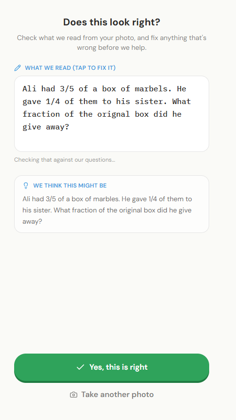
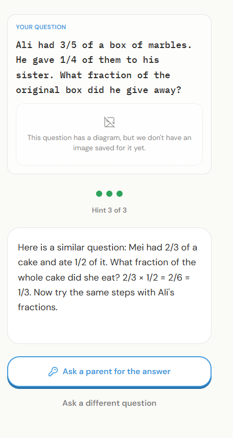
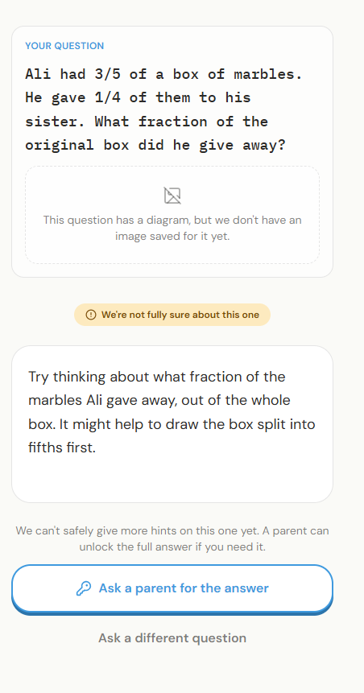

# PSLE Homework Helper

A web app that helps Singapore Primary 6 students with PSLE Mathematics homework by giving hints in increasing
detail, never the final answer. Before giving more than a restatement of the question, the system solves the
question itself and checks its answer against a real answer key. If it cannot verify itself, it says less,
not more.

University of London, CM3070 Final Project. Project template: Project Idea 1, "Orchestrating AI models to
achieve a goal". Author: Stephen Tan De Ming.

## For markers

- **See it without a GPU (about 2 minutes).** Install Node.js 22 and pnpm 10, then run
  `cd frontend`, `pnpm install` and `pnpm dev`, and open http://localhost:3000/preview. Every screen of
  the app is shown there with sample data. See [Option 1](#option-1-view-the-interface-about-2-minutes-no-gpu).
- **Run the full app.** This needs an NVIDIA GPU with 8GB of memory and about 25 GB of model downloads.
  See [Option 2](#option-2-run-the-app-on-the-demo-questions-nvidia-gpu).
- **Check a number from the report.** [docs/EVIDENCE.md](docs/EVIDENCE.md) links each result to the file
  it came from.
- **Read the code.** Start with the files in [Key files](#key-files).
- A 3 to 5 minute demonstration video is submitted with the report.

| Confirm the question | Tier 3 hint: a related worked example | Weak mode: help capped at Tier 1 |
|---|---|---|
|  |  |  |

## Contents

- [For markers](#for-markers)
- [What it does](#what-it-does)
- [How it works](#how-it-works)
- [Requirements](#requirements)
- [Getting started](#getting-started)
- [Running the tests](#running-the-tests)
- [Project structure](#project-structure)
- [Key files](#key-files)
- [Results](#results)
- [Limitations](#limitations)
- [Data and copyright](#data-and-copyright)
- [Terminology](#terminology)
- [Licence](#licence)

## What it does

- Accepts a typed question or a photo of a worksheet question.
- Shows the transcribed question back so the student can correct it before any hint is given.
- Gives hints one tier at a time: a restatement, then a guiding hint, then a related worked example.
- Only goes past the restatement when the question matches a verified answer key and the system's own
  solution agrees with it.
- Screens every input and every hint for unsafe content. Self-harm signals get a caring response with
  Singapore support contacts.
- Lets a parent unlock the full solution with a PIN. Unlocked solutions are always marked as such.

## How it works


| Role | Model | Runs on |
|---|---|---|
| Offline extraction of exam papers (primary and secondary reader) | MinerU2.5, DeepSeek-OCR | GPU, offline only |
| Photo transcription | Qwen3-VL-8B-Instruct (4-bit) | GPU |
| Question matching and retrieval | Qwen3-Embedding-0.6B | CPU |
| Self-solving and hint writing | Phi-4-mini-instruct (4-bit) | GPU |
| Safety screening | ShieldGemma-2B with a cited self-harm lexicon | CPU |
| Exact arithmetic check | SymPy | CPU |

Only one large model is loaded in a server process at a time. After a photo is read, the server restarts
itself while the student checks the text, and the language model loads in the new process for the hints.
Full design: [docs/ARCHITECTURE.md](docs/ARCHITECTURE.md). How each model was chosen:
[docs/MODEL_SELECTION.md](docs/MODEL_SELECTION.md).

| Layer | Technology |
|---|---|
| Frontend | Next.js (App Router), TypeScript, Tailwind CSS, Framer Motion, lucide-react |
| Backend | Python 3.12, FastAPI, Pydantic, SQLAlchemy, SQLite (WAL mode) |
| Models | Hugging Face `transformers`, `bitsandbytes` (NF4), `sentence-transformers`, PEFT |

## Requirements

| Item | Needed for | Tested with |
|---|---|---|
| Node.js 22 and pnpm 10 | Frontend | Node 22, pnpm 10 |
| Python 3.12 | Backend | 3.12 |
| NVIDIA GPU with 8GB memory and a recent driver | Running the models | RTX 4060 Laptop, 8GB |
| About 25 GB free disk | Model downloads | |
| Hugging Face account | Downloading ShieldGemma-2B (a gated model) | |

The full system needs the GPU. Without one, you can still view every screen (Option 1 below) and run the
non-GPU tests.

## Getting started

Download the repository with **Code > Download ZIP** on GitHub and unzip it, or clone it with git. All
commands below are run from the unzipped folder.

### Option 1: view the interface (about 2 minutes, no GPU)

```
cd frontend
pnpm install
pnpm dev
```

Open http://localhost:3000/preview to step through every screen with sample data.

### Option 2: run the app on the demo questions (NVIDIA GPU)

1. Install the backend. The CUDA build of PyTorch is only on PyTorch's own index.

   ```
   cd backend
   python -m venv .venv
   .venv\Scripts\activate            (Windows)   or   source .venv/bin/activate
   pip install -e ".[dev]" --extra-index-url https://download.pytorch.org/whl/cu118
   python ../scripts/setup/environment_canary.py
   ```

   The canary must print `CANARY PASSED`.

2. Get the models.

   - Accept the licence for `google/shieldgemma-2b` on its Hugging Face page, then run
     `huggingface-cli login`. Without this, the safety check cannot load and every request is blocked by design.
   - Download Phi-4-mini into `models/phi-4-mini-instruct`:
     `huggingface-cli download microsoft/Phi-4-mini-instruct --local-dir models/phi-4-mini-instruct`
   - Qwen3-VL-8B-Instruct and Qwen3-Embedding-0.6B download automatically on first use.

3. Build the demo database (12 original PSLE-style questions, run from the repository root):

   ```
   python scripts/dev/seed_demo_db.py
   ```

4. Point the backend at the demo database and precompute the gate results for the 12 questions
   (about 2 minutes). Without this step the gate runs live, and its sampled solutions can differ
   between runs (Issue 389). Run from the repository root:

   ```
   $env:DATABASE_URL="sqlite:///C:/path/to/repo/demo.db"      (PowerShell; use an absolute path)
   export DATABASE_URL=sqlite:////absolute/path/to/repo/demo.db (macOS or Linux)
   python scripts/extraction/precompute_gate_results.py --all
   ```

   Then start the backend in the same terminal:

   ```
   python scripts/server/run_server_supervised.py --port 8000
   ```

5. Start the frontend in a second terminal: `cd frontend`, `pnpm install`, `pnpm dev`, then open
   http://localhost:3000. Try typing one of the demo questions from `scripts/dev/demo_questions.json`.
   The parent PIN for the demo account is `0000`.

Expect about 20 seconds from typing a question to its first hint. The first photo after the server starts
takes about two and a half minutes to read, because the vision model is loaded and quantised on first use,
and the server then restarts once so the language model can load for the hints (about 35 seconds). The API
documentation is at http://localhost:8000/docs while the backend runs.

### Option 3: build the full corpus (needs the source papers)

The full question bank is built from purchased exam papers, which are not included. With the papers placed
as described in [data/README.md](data/README.md), the pipeline is:

Run these from the repository root (the backend is installed in editable mode, so `app` is importable):

```
python -m app.pipeline.render_pages                          # Stage A: render pages to images
bash scripts/extraction/run_deepseek_ocr_resilient.sh        # Stage B: second reader
python -m app.pipeline.extract                               # Stage C: segment, match answer keys, compare readers
python scripts/extraction/run_job_a_dedup.py                 # link duplicates
python scripts/extraction/precompute_question_embeddings.py --all
python scripts/extraction/precompute_gate_results.py --all
```

The first reader (MinerU2.5) is run with the batch runner in
`evaluation/model_selection/ocr_extraction/runners/`. Both OCR readers need their own Python environments; see
`evaluation/model_selection/ocr_extraction/envs/`.

## Running the tests

```
cd backend
python -m pytest -m "not gpu"     # tests that run without a GPU
```

The backend has 415 tests. On the target laptop, 396 pass and 19 are skipped by design because they need
photographs of exam pages, which are not published. Line coverage of the application code is 72%.
319 tests need no GPU and no downloaded models (304 pass, 15 skipped); GitHub Actions runs them on every
push. The other 96 load real models and are marked `gpu`.

The GPU tests load real models. On Windows, loading a model a second time in one process can crash
`transformers` (see Limitations), so run each GPU test file in its own process (PowerShell):

```
$gpu = "test_hint_endpoint","test_safety_wiring","test_boilerplate_row_exclusion","test_live_photo_pipeline","test_matching_and_weak_mode","test_multihint_escalation_endpoint","test_multihint_tier3_and_persistence","test_confirm_and_edit","test_diagram_degrade_path","test_self_harm_detection","test_precompute_cache","test_safety_classifier_crash_fails_closed","test_calibration_logging_audit"
foreach ($f in $gpu) { python -m pytest "tests\$f.py" -q }
```

Tests that need photographs of exam pages are skipped automatically, because those photos are not published.
The frontend is checked by `pnpm lint` and `pnpm build`, which also run in GitHub Actions on every push.
The tests use their own temporary database, whatever `DATABASE_URL` is set to.

## Project structure

```
backend/        FastAPI application and tests
  app/api/        REST endpoints and the six typed response states
  app/pipeline/   Verification gate, matching, safety, extraction
  app/services/   Model loading and the one-model-per-process guard
  app/models/     Database tables
  tests/          Automated tests
frontend/       Next.js client
  src/app/        Routes (main app, /preview)
  src/components/ App flow controller, screens and shared UI
  src/lib/        Typed API client and response types
scripts/        Command-line tools, grouped by purpose
  setup/ server/ extraction/ held_out/ data_quality/ training/ evaluation/ migrations/ dev/
evaluation/     Evidence for the report
  model_selection/  One folder per model comparison, with code and results
  results/          Result summaries from the evaluation experiments
docs/           Architecture, model selection, data and evaluation, development log, evidence map,
                interaction evaluation (ux_review/)
tools/          School-name and filename normalisation used by extraction
data/           Not included; see data/README.md
```

## Key files

Start here to understand the system.

| File | What to look at |
|---|---|
| `backend/app/pipeline/gate.py` | The verification gate: routing by question type, SymPy check, self-consistency, tier decision |
| `backend/app/api/routes.py` | How a hint request moves through safety, gate and hint generation |
| `backend/app/api/submission_routes.py` | Photo upload, transcription, confirm and edit |
| `backend/app/pipeline/question_matching.py` | Matching a question to the corpus, with the false-match checks |
| `backend/app/pipeline/self_harm_detection.py` | Safety classifier and lexicon, fail-closed behaviour |
| `backend/app/services/llm_service.py`, `vlm_service.py`, `swap_tracker.py` | Loading the 4-bit models, and restarting the server instead of switching models in one process |
| `backend/app/pipeline/extract.py` | Extraction stage C: `segment_questions`, `parse_answer_key_grid`, `compare_readers` |
| `frontend/src/components/app-flow.tsx` | The frontend state machine that renders one screen per response state |
| `frontend/src/lib/api-client.ts` | Typed calls to the backend |

## Results

| Measure | Result |
|---|---|
| Questions extracted | 5,819 from 140 scanned papers |
| Reader disagreement | 13.3% of questions |
| Grounding experiment (388 held-out questions) | Base 13.9%, retrieval 12.9%, fine-tuned 12.9%; no significant difference |
| Safety | Self-harm recall 9/10, 0 false positives |
| Hint quality (blind judge, 1 to 5) | Tier 2 scaffolding 3.06 |

Every figure is linked to its source file in [docs/EVIDENCE.md](docs/EVIDENCE.md). Details:
[docs/DATA_AND_EVALUATION.md](docs/DATA_AND_EVALUATION.md). Development history:
[docs/DEVELOPMENT_LOG.md](docs/DEVELOPMENT_LOG.md).

## Limitations

- Full tiered help is only available for questions matched to the verified corpus. New questions get Tier 1.
- A typed question reaches its first hint in about 20 seconds. The first photo after the server starts takes
  about two and a half minutes to read, because the vision model is loaded and quantised on first use.
- No diagram model reached usable accuracy on 8GB, so diagram questions receive an explicit "I can't see the
  figure" response.
- Loading a second model in the same process crashes the `transformers` library on Windows, so the server
  restarts itself after each photo read. The frontend waits and retries while it restarts.
- Voice input and topic classification were designed but not built, because no labelled evaluation data exists.

## Data and copyright

The PSLE papers, school practice papers and everything derived from them (page images, OCR output, the
question database, training data) are not included. Singapore's Copyright Act 2021 section 244 permits
computational analysis of lawfully obtained works, not redistribution. The demo questions in
`scripts/dev/demo_questions.json` are original.

## Terminology

| Term | Meaning |
|---|---|
| PSLE | Primary School Leaving Examination, the national exam at the end of primary school in Singapore |
| P6 | Primary 6, the final year of primary school (12 years old) |
| SA1, SA2, WA, CA | School assessments: mid-year and end-of-year exams, and smaller weighted or continual tests |
| Booklet A, Booklet B, Paper 2 | Sections of the PSLE Mathematics paper; question numbers restart in each |
| Bar model, units | The Singapore method of drawing quantities as bars and reasoning in "units" |
| Tier | A level of hint, from 1 (restatement) to 3 (worked example) |
| Gate | The check that decides which tiers the system may give |
| Weak mode | Help for a question with no verified answer key, capped at Tier 1 |
| Phase N | One build phase of the project; the phases are listed in [docs/DEVELOPMENT_LOG.md](docs/DEVELOPMENT_LOG.md) |
| Issue N | Entry N in [docs/DEVELOPMENT_LOG.md](docs/DEVELOPMENT_LOG.md), a numbered problem or decision |
| Conditions A, B, C (C2, C3) | Base model; with retrieval and examples; with a fine-tuned adapter (two later variants) |
| Bucket 1, 2, 3 | Diagram types: charts, simple geometry, bar models and number lines |

## Licence

All rights reserved. See [LICENSE](LICENSE).
