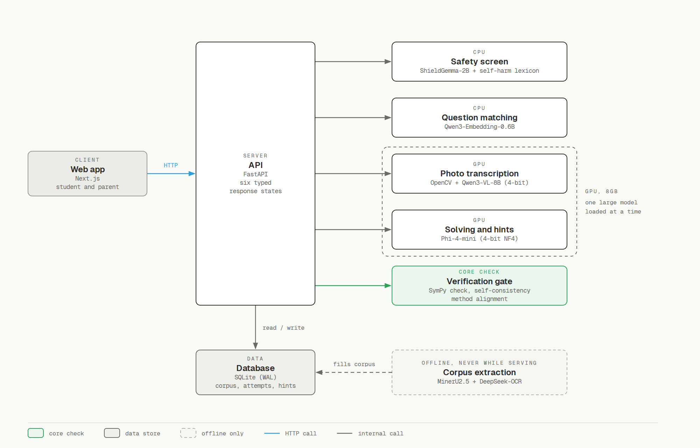
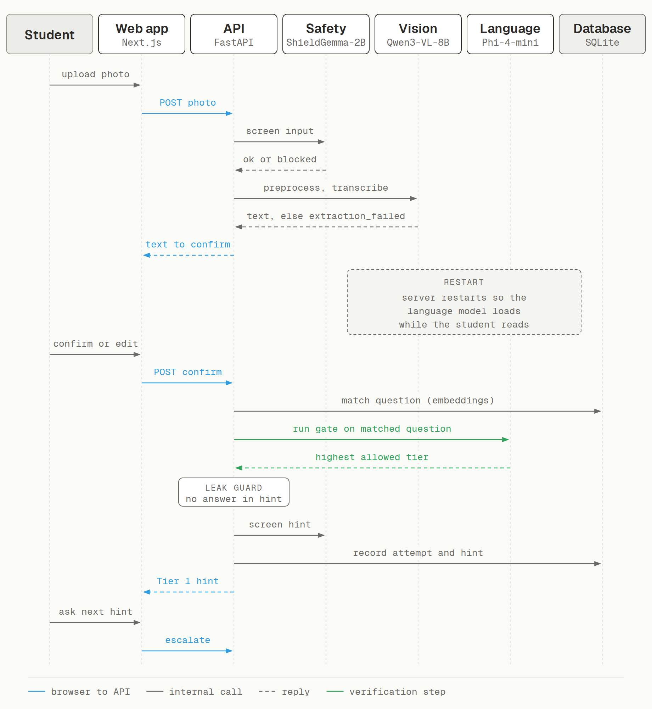
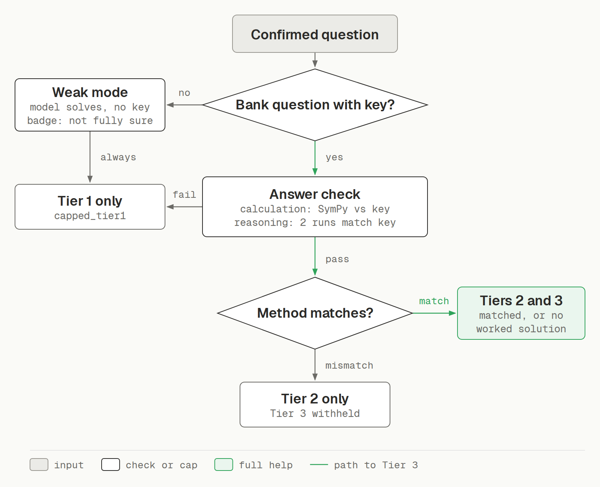

# Architecture

This document describes how the PSLE Homework Helper is built: its components, how a request flows through
them, the verification gate, the API contract, the data model and the hardware plan. For how each model was
chosen, see [MODEL_SELECTION.md](MODEL_SELECTION.md). For the data and evaluation, see
[DATA_AND_EVALUATION.md](DATA_AND_EVALUATION.md).

## 1. Goal and design principles

The system helps a Primary 6 student (12 years old) with PSLE Mathematics homework by giving hints in
increasing detail, never the final answer. A parent can unlock the full solution with a PIN.

Four principles shape every component:

1. **Verify before helping.** The system only gives more than a restatement of the question when it has
   checked its own answer against a real answer key.
2. **Fail closed.** When a model is unavailable, uncertain or unsafe, the system falls back to the safest
   response (Tier 1, a retry message, or a safety block), never to a guess.
3. **Transcribe, then interpret.** A photo is transcribed literally first, so a student's own mistake is kept,
   not silently corrected.
4. **Run locally.** Every model runs on one machine with an 8GB consumer GPU. No student data leaves it.

## 2. Components

| Layer | Component | Implementation |
|---|---|---|
| Client | Web app (student and parent) | Next.js, TypeScript, Tailwind CSS, Framer Motion (`frontend/`) |
| API | REST endpoints, typed responses | FastAPI, Pydantic (`backend/app/api/`) |
| Safety | Input and output screening | ShieldGemma-2B on CPU, OR-combined with a cited self-harm lexicon (`pipeline/self_harm_detection.py`, `self_harm_lexicon.py`) |
| Perception | Photo clean-up and transcription | OpenCV preprocessing and skew check, Qwen3-VL-8B-Instruct (`pipeline/photo_preprocessing.py`, `services/vlm_service.py`) |
| Retrieval | Match a question to the corpus | Qwen3-Embedding-0.6B, in-memory cosine similarity with conflict checks (`pipeline/question_matching.py`) |
| Reasoning | Self-solving and hint writing | Phi-4-mini-instruct, 4-bit NF4 (`services/llm_service.py`) |
| Verification | The gate | SymPy exact check, multi-sample self-consistency, method alignment (`pipeline/gate.py`) |
| Data | Corpus, attempts, hints, flags | SQLite in WAL mode via SQLAlchemy (`app/models/`, `app/db/`) |
| Offline | Corpus extraction | Render pages, two OCR readers (MinerU2.5, DeepSeek-OCR), merge and match answer keys (`pipeline/render_pages.py`, `pipeline/extract.py`) |

The offline extraction layer runs alone on the GPU, never while the app is serving students.

## 3. Request flow

1. **Input.** The student types a question or uploads a photo.
2. **Safety screen (input).** Flagged input returns `safety_blocked` with a category-appropriate message.
   The language model never sees it. If the classifier fails, the request is blocked (fail closed).
3. **Perception (photo only).** The photo is resized, checked for skew and transcribed by the vision model.
   A low-confidence or unreadable transcription returns `extraction_failed` with a reason.
4. **Confirmation.** The raw transcription is shown back (`needs_confirmation`). The student can correct it.
   While the student reads, the vision model is unloaded and the language model is loaded.
5. **Match.** The confirmed text is matched against the extracted corpus. A confident match gives the gate a
   real answer key and worked solution. No match means weak mode.
6. **Gate.** Decides the highest tier the system is allowed to give (Section 4).
7. **Hint.** The first hint is always Tier 1. The student asks for the next hint through the escalate
   endpoint, one tier at a time, up to the tier the gate allowed.
8. **Safety screen (output).** Every hint is checked before it is shown. A flagged hint is regenerated up to
   twice, then blocked.
9. **Record.** Attempts, hints and any safety flags are written to the database.

## 4. The verification gate

The gate is the core of the project. It answers one question: "Does the system understand this question well
enough to help beyond a restatement?"

1. **Is there a verified answer key?** A corpus question, or a photo confidently matched to one, takes the
   verified path. Anything else takes weak mode.
2. **Weak mode.** The model solves the question with no key. Whatever the result, help is capped at Tier 1
   and the response is labelled `is_unverified`. The system never claims understanding it cannot check.
3. **Verified path, routed by question type.**
   - *Calculation questions*: the model's answer is checked exactly against the key with SymPy.
     Model arithmetic is never trusted on its own.
   - *Reasoning questions* (word problems, bar models): the model solves the question twice with independent
     sampling. Both answers must agree with each other and with the key.
4. **Method alignment.** The model's method is compared with the stored worked solution, to catch a right
   answer reached by a wrong method.
5. **Decision.** All checks pass: Tier 2 and Tier 3 are allowed. Any disagreement, missing answer or
   mismatch: Tier 1 only (`capped_tier1`).

Hints above Tier 1 are written from the verified worked solution, not from a fresh unverified generation.
Results for corpus questions are precomputed offline and cached. The cache key includes the gate version,
the model, the adapter and a fingerprint of the question content, so any change falls back to a live check.

### Hint tiers

| Tier | Content | When available |
|---|---|---|
| 1 | Restates the question in plain words | Always |
| 2 | A guiding hint built from the verified solution path | Gate passed |
| 3 | A related worked example to follow | Gate passed with full agreement |
| Unlock | Full worked solution, visibly marked as unlocked by a parent | Correct parent PIN |

## 5. API contract

All endpoints return one of six typed states (`backend/app/api/schemas.py`). The frontend renders one screen
per state, so every outcome the backend can produce has a designed screen.

| State | Meaning |
|---|---|
| `needs_confirmation` | Transcribed text waiting for the student to confirm or edit |
| `hint` | A hint at tier 1 to 3, with whether more help is available |
| `capped_tier1` | Tier 1 only, because verification failed or no key exists |
| `safety_blocked` | A caring message, with support resources on the self-harm path |
| `extraction_failed` | The photo could not be read: `unreadable_photo`, `low_confidence`, `reader_unavailable` or `photo_not_straight` |
| `unlocked_solution` | The full solution after a correct parent PIN |

| Endpoint | Purpose |
|---|---|
| `POST /api/questions/{id}/hint` | First hint for a corpus question |
| `POST /api/submissions/photo` | Upload a photo |
| `POST /api/submissions/photo-question` | Submit typed question text |
| `POST /api/submissions/{id}/confirm` | Confirm the transcription and get the first hint |
| `POST /api/submissions/{id}/edit` | Correct the transcription |
| `POST /api/attempts/{id}/escalate` | Next hint, one tier at a time |
| `POST /api/questions/{id}/unlock` | Parent PIN unlock (argon2 hash, 5 attempts, 15-minute lockout) |

## 6. Data model

| Table | Holds |
|---|---|
| `questions` | Extracted corpus questions: text, answer, worked solution, source paper and page, section, diagram flag, OCR confidence, quality flags, duplicate pointer |
| `ocr_extraction_records` | Both OCR readers' output per question and whether they agree |
| `question_embeddings` | Cached embedding vectors for matching |
| `precomputed_gate_results` | Cached gate decisions, versioned and fingerprinted |
| `student_submissions` | Photo or typed submissions, raw transcription, match result |
| `attempts` | One per question attempt, current tier |
| `hint_events` | Every hint shown, with the gate result |
| `safety_flags` | Flagged inputs or outputs and their category |
| `students`, `parent_accounts` | Demo student and hashed parent PIN |

Rows are never deleted. Duplicates point to a surviving row (`superseded_by`), and bad rows are excluded
through flags, so every change can be audited.

## 7. Hardware and serving

| Item | Value |
|---|---|
| GPU | NVIDIA RTX 4060 Laptop, 8GB |
| CPU / RAM | Intel i9-13900HX / 32GB |
| Precision | 4-bit NF4 (bitsandbytes) for the language and vision models |
| Serving | Hugging Face `transformers`, one process |

Rules that follow from the 8GB limit:

- Each server process loads at most one large model (Phi-4-mini or Qwen3-VL-8B) and never switches.
  Loading a second model in the same process crashes the `transformers` library on Windows (Issues 364
  to 366, 385), so `swap_tracker.guard()` refuses any switch.
- After a successful photo read, the server restarts itself (`swap_tracker.trigger_restart()`) while the
  student checks the transcribed text. `scripts/server/run_server_supervised.py` starts a fresh process,
  and the language model loads there for the first hint.
- While the server restarts, the frontend keeps waiting and retries for up to 150 seconds instead of
  showing an error. The first hint after a photo arrived 45 seconds after the student confirmed.
- The embedding model and ShieldGemma run on the CPU.

## 8. Known architectural limits

- `backend/app/pipeline/` mixes offline extraction modules (`extract.py`, `render_pages.py`, `dedup.py`) with
  live request modules (`gate.py`, `question_matching.py`, safety). A future version would separate them.
- `extract.py` is large because it handles many answer-key layouts found in real papers. Splitting it into
  per-layout modules is future work.
- No diagram model is connected. Diagram questions return an explicit "I can't see the figure" response.
